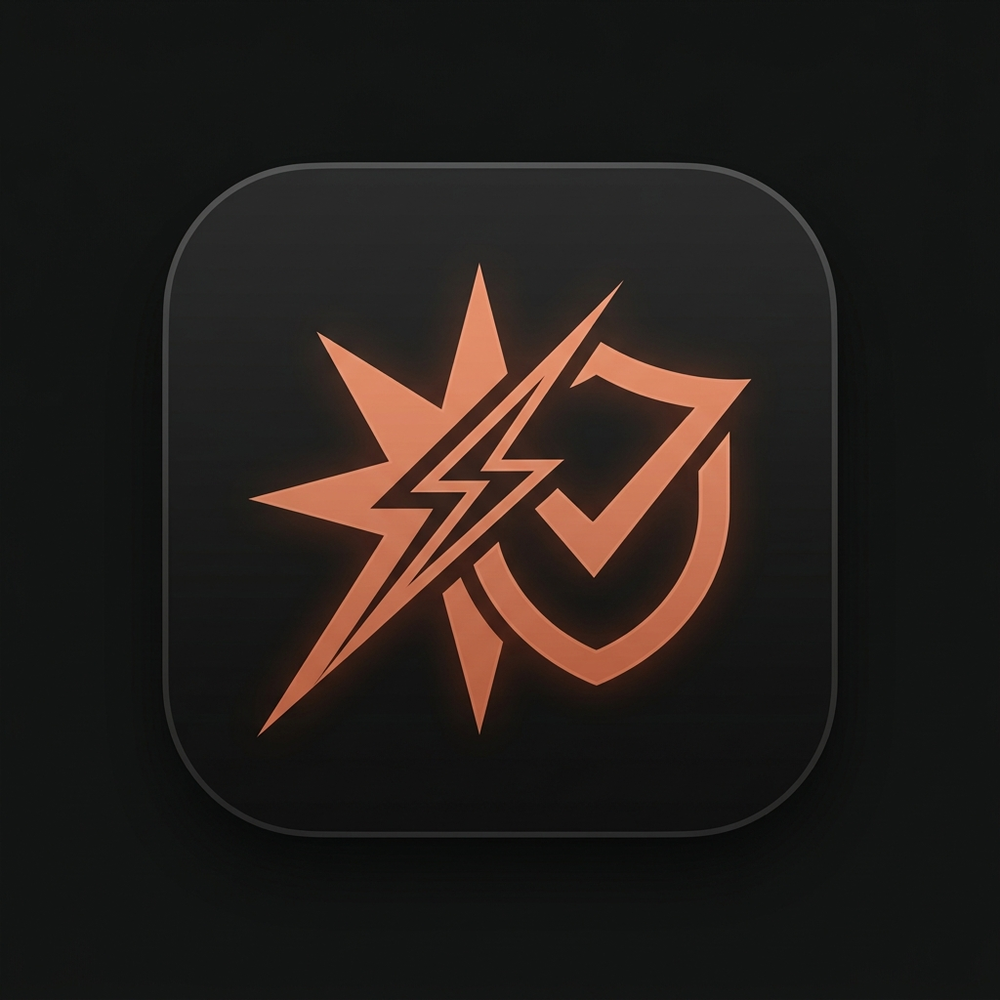

<div align="center">

<table>
  <tr>
    <td width="28%" align="center" style="border:none; background: transparent; vertical-align: middle;">
      
      <br />
      <span style="font-family: 'JetBrains Mono', monospace; font-size: 13px; font-weight: bold; color: #cc785c; letter-spacing: 0.5px;">API-QUICKCHECK 2.0</span>
    </td>
    <td width="72%" align="left" style="border:none; background: transparent; vertical-align: middle;">
      <pre lang="text">
  █████╗ ██████╗ ██╗    ██████╗ ██╗   ██╗██╗ ██████╗██╗  ██╗
 ██╔══██╗██╔══██╗██║   ██╔═══██╗██║   ██║██║██╔════╝██║ ██╔╝
 ███████║██████╔╝██║   ██║   ██║██║   ██║██║██║     █████╔╝ 
 ██╔══██║██╔═══╝ ██║   ██║▄▄ ██║██║   ██║██║██║     ██╔═██╗ 
 ██║  ██║██║     ██║   ╚██████╔╝╚██████╔╝██║╚██████╗██║  ██╗
 ╚═╝  ╚═╝╚═╝     ╚═╝    ╚══▀▀═╝  ╚═════╝ ╚═╝ ╚═════╝╚═╝  ╚═╝
               ██████╗██╗  ██╗███████╗ ██████╗██╗  ██╗
              ██╔════╝██║  ██║██╔════╝██╔════╝██║ ██╔╝
              ██║     ███████║█████╗  ██║     █████╔╝ 
              ██║     ██╔══██║██╔══╝  ██║     ██╔═██╗ 
              ╚██████╗██║  ██║███████╗╚██████╗██║  ██╗
               ╚═════╝╚═╝  ╚═╝╚══════╝ ╚═════╝╚═╝  ╚═╝
 ─────────────────────────────────────────────────────────────
 ⚡ Universal AI Relay Forensics, Batch Testing & Agent Adapter
      </pre>
    </td>
  </tr>
</table>

<p>
  <a href="https://www.npmjs.com/package/api-quickcheck"></a>
  <a href="https://www.npmjs.com/package/api-quickcheck"></a>
  <a href="https://github.com/som1ng/API-QuickCheck/stargazers"></a>
  <a href="https://github.com/som1ng/API-QuickCheck/blob/main/LICENSE"></a>
  <a href="https://api-quick-check.vercel.app/"></a>
</p>

<p>
  <a href="https://api-quick-check.vercel.app/"><strong>Live Demo</strong></a> ·
  <a href="#why-api-quickcheck-20"><strong>Why QuickCheck</strong></a> ·
  <a href="#the-9-frontier-models-supported"><strong>9 Flagship Models</strong></a> ·
  <a href="#24-probe-forensics-matrix"><strong>24-Probe Suite</strong></a> ·
  <a href="#batch-api-key-testing"><strong>Batch Testing</strong></a> ·
  <a href="#industrial-headless-cli"><strong>Headless CLI</strong></a> ·
  <a href="#quick-start"><strong>Quick Start</strong></a> ·
  <a href="./README_zh.md"><strong>中文说明</strong></a>
</p>

</div>

---

## Why API-QuickCheck 2.0?

In today's AI API relay and proxy marketplace, **model substitution fraud** (e.g. routing requests to cheap quantized checkpoints, fake `<think>` reasoning tags, silent context truncation, and proxy-level rate-limiting) is a prevalent problem for agent builders and developers.

**API-QuickCheck 2.0** is an industrial-grade forensics engine designed to verify the true identity, streaming quality, and agent capability of your model endpoints against **the 9 latest frontier models**:

- **Cryptographic Verification**: Anthropic official private-key **Thinking Signature turn-2 verification**;
- **Thought Stream Forensics**: Native `reasoning_content` delta validation exposing hardcoded fake reasoning tags;
- **Microsecond Precision**: Measures **TTFT (Time to First Token)**, live **TPS throughput**, and **Chunk Jitter variance**;
- **Industrial Batch Testing**: **±25% Jitter anti-ban scheduling**, domain endpoint memory caching, and balance sniffing;
- **Autonomous 2026 Baselines**: 3-day automated CI/CD synchronization with authoritative model catalogs;
- **Zero Data Logging**: Crafted in the **Anthropic Claude Warm Dark Editorial Design System**, with **100% in-memory client execution**.

---

## The 9 Frontier Models Supported

API-QuickCheck 2.0 is calibrated against the 9 models shaping modern agent workflows across OpenAI, Anthropic, Google, and xAI:

```text
┌─────────────────────────┬───────────────────────────────┬─────────────────────────────────────────────────────────────┐
│ Provider                │ Model ID                      │ Frontier Tier & Core Forensics Focus                        │
├─────────────────────────┼───────────────────────────────┼─────────────────────────────────────────────────────────────┤
│ OpenAI                  │ gpt-5.6-sol                   │ Flagship Frontier · Hard Tool Planning, Code Repair, 64K    │
│                         │ gpt-5.6-terra                 │ Balanced Workhorse · Responses API & Strict JSON Schema     │
│                         │ gpt-5.6-luna                  │ Sub-Second High-Throughput · Low Latency Agent Execution   │
├─────────────────────────┼───────────────────────────────┼─────────────────────────────────────────────────────────────┤
│ Anthropic               │ claude-fable-5                │ Next-Gen Frontier · Adaptive Thinking Signature Continuity │
│                         │ claude-opus-5                 │ Frontier Coding & Deep Reasoning · Complex Tool Chains      │
│                         │ claude-sonnet-5               │ Balanced Agent Workhorse · Messages API & Prompt Caching    │
├─────────────────────────┼───────────────────────────────┼─────────────────────────────────────────────────────────────┤
│ Google                  │ gemini-3.1-pro-preview        │ 2M Multimodal Frontier · Thought Signature & PDF/Chart Ext  │
│                         │ gemini-3.7-flash              │ Ultra-Fast Agent Orchestrator · Interactions API Routine    │
├─────────────────────────┼───────────────────────────────┼─────────────────────────────────────────────────────────────┤
│ xAI                     │ grok-4.6                      │ Realtime Frontier · Controlled Tools, Reasoning & Sandbox   │
└─────────────────────────┴───────────────────────────────┴─────────────────────────────────────────────────────────────┘
```

---

## 24-Probe Forensics & Capability Matrix

Every model is audited against our **24-Probe Balanced Suite** across 4 critical layers:

```text
                                 ┌── [ P0 Protocol (7) ] ➔ Model Discovery, Native Route, Auth, SSE Stream, Strict JSON, Tool Shape, Invalid Param
                                 ├── [ P1 Architecture (5) ] ➔ Reasoning Config, State Continuity, Tool Roundtrip, Signature Continuity, Cache Semantics
API-QuickCheck 2.0 ──────────────┼── [ P2 Capability (8) ] ➔ Constraint JSON, Tool Planning, Code Repair (A/B), Vision Chart, Needle Context (Start/Mid/End)
                                 └── [ P3 Quality (4) ] ➔ Cold Start TTFT, Concurrency TPS, Network Jitter, P95 Stability Samples
```

### 1. Deep Fidelity & Downgrade Forensics
- **Anthropic Official Private-Key Thinking Signature Check (`p1-signature-continuity`)**:
  Captures the cryptographic private-key signature inside the `thinking` block, then injects it back in turn 2. If the relay routed to a downgraded or counterfeit model, the second turn will fail cryptographic verification instantly.
- **Native Thought Stream vs. Injected Text (`p0-native-route`)**:
  Differentiates between true SSE `reasoning_content` delta events and text `<think>` tags spoofed by middleman proxies.
- **Metacognitive & 64K Needle In A Haystack Probes (`p2-context-start/middle/end`)**:
  Tests deep context retrieval at 64,000 tokens across start, middle, and end positions to catch silent context truncations.

### 2. High-Precision Streaming Speed Benchmark
- **Microsecond TTFT (Time to First Token)**: Accurately isolates network queueing and handshake latency from model compute time.
- **Real-Time Token Throughput (TPS)**: Live velocity tracker with visual terminal typewriter animation.
- **Jitter Variance Matrix**: Measures inter-chunk delivery variance to reveal proxy rate-limiting and buffer stalling.

---

## Batch API-Key Testing & Anti-Ban Pool

Test hundreds of API Keys concurrently with enterprise-grade resilience:

- **Smart Dirty Text Extraction**: Cleans messy pastes from plain text, commas, CSV columns, and JSON arrays.
- **Adaptive Anti-Ban Protection**:
  - **±25% Jitter Delay**: Desynchronizes concurrent requests to bypass middleman rate-limit thresholds;
  - **Domain Endpoint Memory Pool**: Caches working endpoint routes to reduce probing traffic by 80%;
  - **429 Circuit Breaker**: Automatically backs off upon gateway congestion.
- **Universal Quota Sniffer**: Multi-endpoint balance parser supporting **OneAPI, NewAPI, DoneAPI, OpenRouter, SiliconFlow, DeepSeek**.
- **Multi-Format Export**: 1-click export to TXT, CSV (Excel UTF-8 BOM compliant), JSON with 20-batch history rollback.

---

## Technical Comparison Matrix

| Evaluation Dimension | Traditional Shell Scripts | Generic Online Ping Sites | **API-QuickCheck 2.0** |
| :--- | :---: | :---: | :---: |
| **Frontier Model Coverage** | Outdated (GPT-3.5/4) | Partial Claude 3.5 | **Full 9 Flagship Models (GPT-5.6 / Fable 5 / Gemini 3.7 / Grok 4.6)** |
| **Private-Key Cryptographic Auth** | Not Supported | Incomplete text heuristic | **100% Official Turn-2 Signature Verification** |
| **Reasoning Stream Forensics** | Not Supported | Not Supported | **Native `reasoning_content` validation** |
| **Batch Key Anti-Ban Engine** | High ban risk | Basic sequential ping | **±25% Jitter + Endpoint Memory Cache** |
| **Hidden Model Discovery** | Exits on 404 | Not Supported | **Dual-Engine + 16-Model Fast Prober** |
| **Automated 2026 Baseline Sync** | Hardcoded | Outdated | **Every 3-Day CI/CD Auto-Sync & Manual UI** |
| **Design Aesthetics** | Basic / Cluttered | Chaotic dashboard | **Anthropic Warm Dark + Tactile Magic Slider** |
| **API Key Privacy** | Uploaded to server | Stored in cloud DB | **100% In-Memory · Zero Server Logging** |

---

## Industrial Headless CLI

API-QuickCheck features a zero-dependency, CI/CD-ready terminal CLI (`scripts/apiqc.ts`) for headless forensics and automated baseline capture.

```bash
# Option A: Zero-install instant execution via npx (Recommended)
npx api-quickcheck audit \
  --model gpt-5.6-sol \
  --base-url https://api.your-relay.com/v1 \
  --api-key sk-your-key-here

# Option B: Global CLI installation
npm install -g api-quickcheck
apiqc audit \
  --model claude-fable-5 \
  --base-url https://api.your-relay.com/v1 \
  --api-key sk-your-key-here \
  --probes p0-stream-events,p0-strict-json,p1-signature-continuity

# Option C: In-repo developer execution
npm run apiqc -- audit \
  --model gpt-5.6-sol \
  --base-url https://api.your-relay.com/v1 \
  --api-key sk-your-key-here
```

### CLI Command Options

| Option | Type | Description | Default |
| :--- | :--- | :--- | :--- |
| `--model` | `string` | **Required**. Target model ID to audit | - |
| `--base-url` | `string` | **Required** (or `APIQC_BASE_URL` env). Relay or official API base URL | - |
| `--api-key` | `string` | **Required** (or `APIQC_API_KEY` env). Key used in-memory only | - |
| `--provider` | `string` | `auto`, `openai`, `anthropic`, `gemini`, `xai` | `auto` |
| `--profile` | `string` | Audit depth: `quick` (4 probes), `balanced` (24 probes), `deep` (24 probes) | `balanced` |
| `--probes` | `string` | Comma- or space-separated list of specific probe IDs to execute | All profile probes |
| `--out` | `string` | Path to save JSON audit report | `audit-report.json` |
| `--baseline` | `string` | ID of stored baseline file for comparative scoring | - |

---

## Quick Start

### Option 1: Zero-Install Instant Execution via npx (Recommended)
Run directly in any terminal without cloning the repo:
```bash
npx api-quickcheck audit --model gpt-5.6-sol --base-url https://api.your-relay.com/v1 --api-key sk-xxx
```

### Option 2: Live Web App
Visit the official deployment directly: **[https://api-quick-check.vercel.app/](https://api-quick-check.vercel.app/)**

### Option 3: Global System Command Installation
```bash
npm install -g api-quickcheck

# Run anytime using the short alias:
apiqc audit --model claude-fable-5 --base-url https://api.your-relay.com/v1 --api-key sk-xxx
```

### Option 4: Local Source Code Development

```bash
# 1. Clone repository
git clone https://github.com/som1ng/API-QuickCheck.git
cd API-QuickCheck

# 2. Install dependencies
npm install

# 3. Start local development server
npm run dev

# 4. Run automated test suite
npm test
```

---

## Tech Stack

- **Core Engine**: React 18, TypeScript, Vite
- **Design System**: Anthropic Claude Warm Dark Editorial System, TailwindCSS
- **Rendering & Math**: ReactMarkdown, KaTeX, Rehype-Katex, Mermaid.js
- **Icons**: Lucide React
- **Edge Deployment**: Vercel Serverless Edge Functions

---

## License

Distributed under the **MIT License**. See `LICENSE` for more information.
