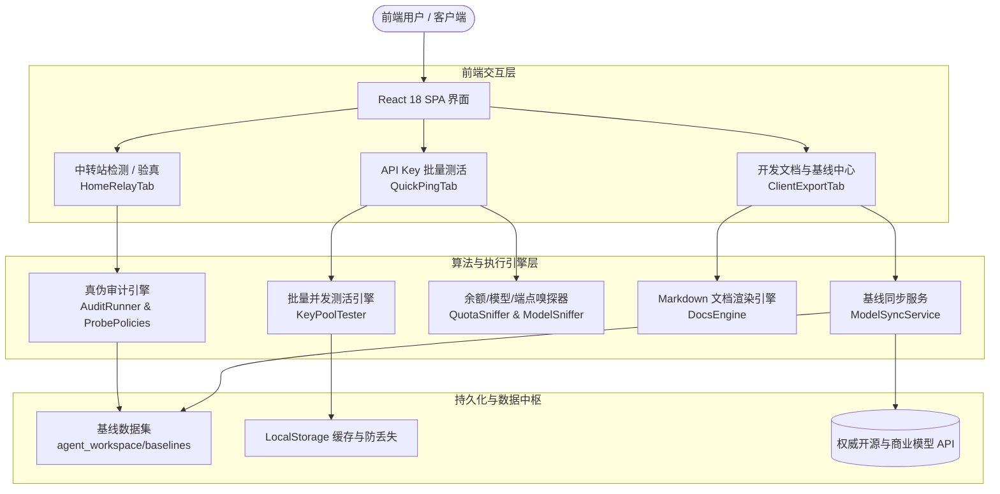

# API-QuickCheck 系统全局架构与模块设计规范

本文档为所有参与 `API-QuickCheck` 开发与维护的 Agent（主 Assistant 及各 Subagents）提供统一的系统架构视图、数据流转规约与协作约定。

---

## 1. 系统架构全景

---

## 2. 核心模块与职责分工

### 2.1 批量测活引擎 (`src/engine/batchKeys/`)
- **智能格式清洗** (`parseRawKeysInput`)：支持从换行、逗号、CSV 表格、JSON、带前缀混乱文本中提取合法 API Key。
- **并发池调度与防封** (`runBatchKeyTestPool`)：
  - 并发抖动延时（±25% Jitter）与频率平滑；
  - 429 智能熔断退避；
  - 域名端点记忆池（记录成功端点，后续测试发包减少 80%）。
- **余额与模型探测** (`sniffKeyBalance`, `sniffKeyModels`)：多端点自动尝试提取可用余额与支持模型。

### 2.2 真伪审计与探针引擎 (`src/engine/audit/`)
- 按照 `agent_workspace/baselines/probe-policy.json` 中的策略对模型进行分级探针测试：
  - `p0-stream-events`：流式 Event-Stream 事件结构与真实 Token 吞吐；
  - `p0-strict-json`：严格结构化输出与 JSON Schema 校验；
  - `p0-tool-shape` / `p1-tool-roundtrip`：函数调用与多轮状态维持；
  - `p2-context-start`：长上下文针刺检索真伪验证；
  - `p2-chart-extraction`：多模态视觉能力鉴别。

### 2.3 2026 前沿模型基线更新体系 (`src/engine/baselines/` & `scripts/`)
- **同步服务 (`modelSyncService.ts`)**：支持浏览器端（文档右上角按钮）与 Node CLI 端无缝双模调用；
- **定时流水线 (`.github/workflows/sync-model-baselines.yml`)**：每 3 天自动执行 `npm run sync:models`；
- **回写目标**：更新 `src/content/docs/` 中的 Markdown 文档及 `agent_workspace/baselines/` 中的结构化 JSON。

---

## 3. 设计规范与 UI 交互约束 (`DESIGN.md`)

- **调色盘标准**：严格对齐 Claude 暖暗调规范（Anthropic Warm Dark）。
  - 背景：`#141413`
  - 卡片底色：`#181715`
  - 提升层/滑块：`#252320`
  - 边框：`#2e2b27`
  - 品牌珊瑚橙：`#cc785c`
  - 文字主色：`#faf9f5` / 正文 `#d5d1c8` / 辅助 `#a09d96`
- **磁吸滑块 (Magic Slider)**：
  - 侧边栏与 Tab 切换必须使用基于局部容器的高精度物理滑块，绝对定位 `left-0 right-0`，严禁产生视口坐标漂移。
