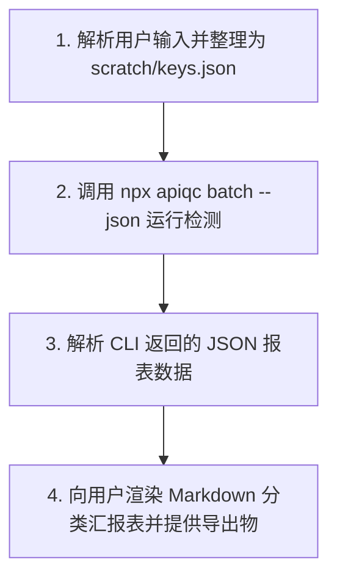

# Batch API Key Audit & Quality Assurance Skill

本技能为 AI Agent（如 Claude Code, Antigravity, Cursor, RooCode 等）提供专业的 **API-Key 资产池批量质检与质量审计** 能力。

---

## 🎯 核心使用场景

1. **批量连通性与存活检测**：快速排查一批 API-Key 中哪些是死 Key（401 鉴权失败、403 权限不足、429 限流或网络超时）。
2. **多模型支持度矩阵扫描**：测试单个 Key / 中转端点是否真实支持指定模型列表（如 `claude-3-7-sonnet`, `gpt-4o`, `deepseek-r1`）。
3. **模型防伪与真假验签**：利用 Anthropic Thinking Signature 官方私钥验签和 DeepSeek 原生思维流探针，识别中转站是否存在“小模型换皮冒充”、“降级量化”或“虚假回复”。
4. **延迟与吞吐性能测速**：测量 TTFT（首字延迟毫秒数）与 TPS（生成速度），帮用户挑出最快端点。
5. **资产清洗与导出**：自动剔除死 Key 和假模型，将 100% 可用的健康 Key 导出为 `.env` 或 `.json` 交付给用户。

---

## 🛠️ CLI 指令调用速查

本技能基于 `api-quickcheck` CLI 引擎执行。Agent 应优先通过 `--json` 模式执行命令以获取机器可读的标准结果：

### 1. 批量检测文件中的 API-Key（推荐）
```bash
npx apiqc batch --input ./pending_keys.json --models "claude-3-7-sonnet,gpt-4o,deepseek-r1" --json
```

### 2. 用户直接在对话中粘贴多组 Key 时（管道或临时文件）
```bash
# Agent 将用户提供的列表写入临时文件后执行：
npx apiqc batch --input scratch/keys.json --concurrency 5 --profile quick --json
```

### 3. 批量检测并直接导出可用 Key 清单
```bash
# 导出为干净的 .env 格式
npx apiqc batch --input ./keys.csv --export-valid ./valid_keys.env --json

# 导出为表格报表
npx apiqc batch --input ./keys.json --export-csv ./audit_summary.csv --json
```

---

## 📋 待测输入格式规范

CLI 支持以下 4 种输入格式：

### 格式 A：JSON 数组（最推荐）
```json
[
  {
    "name": "中转站-主力A",
    "baseUrl": "https://api.relay-a.com/v1",
    "apiKey": "sk-xxx1",
    "models": ["claude-3-7-sonnet", "gpt-4o"]
  },
  {
    "name": "DeepSeek直连",
    "baseUrl": "https://api.deepseek.com/v1",
    "apiKey": "sk-xxx2",
    "models": ["deepseek-r1"]
  }
]
```

### 格式 B：CSV 表格
```csv
name,baseUrl,apiKey,models
中转A,https://api.relay-a.com/v1,sk-xxx1,claude-3-7-sonnet
中转B,https://api.relay-b.com/v1,sk-xxx2,gpt-4o
```

### 格式 C：`.env` 格式
```env
OPENAI_API_KEY=sk-xxx
ANTHROPIC_API_KEY=sk-yyy
DEEPSEEK_API_KEY=sk-zzz
```

### 格式 D：纯 Key 列表（每行一个）
```text
sk-11111111111111111111111111
sk-22222222222222222222222222
```

---

## 🤖 Agent 标准执行工作流

当用户提出批量检测需求时，Agent 遵循以下 4 步执行：



### 步骤 1：准备输入
若用户直接在对话中发送了 Key 列表，Agent 负责将其解析并保存到 `scratch/batch_keys.json` 中。

### 步骤 2：执行检测
运行 `npx apiqc batch --input scratch/batch_keys.json --models "<models>" --json`。

### 步骤 3：结构化数据分析与分类
对 CLI 返回的 JSON 进行分类：
- 🟢 **健康正品 (Healthy)**：所有指定模型均通过且被判定为 `genuine`（官方正品）。
- 🟡 **部分降级/异常 (Degraded)**：部分模型可用，但存在模型不支持、延迟过高或防伪验签缺失。
- 🔴 **完全失效 (Dead)**：HTTP 401 密钥无效、403 封禁、429 欠费/限流或网络彻底不通。

### 步骤 4：向用户呈现报告
使用标准 Markdown 表格输出检测结果，示例模板如下：

```markdown
### 📊 API-Key 批量质检报告 (共 X 个)

| 序号 | 名称/标识 | API 端点 | 掩码 Key | 模型测试结果 | 综合状态 | 平均延迟 |
| :--- | :--- | :--- | :--- | :--- | :--- | :--- |
| 1 | 中转A | `https://api.a.com/v1` | `sk-1234...cdef` | ✅ claude-3-7-sonnet (🔏已验签)<br>✅ gpt-4o | 🟢 正常/真品 | 280ms |
| 2 | 中转B | `https://api.b.com/v1` | `sk-5678...ghij` | ❌ claude-3-7-sonnet (⚠️无官方签名，疑似换皮) | 🟡 疑似降级 | 1250ms |
| 3 | 备用C | `https://api.c.com/v1` | `sk-9012...klmn` | ❌ HTTP 401: Invalid API Key | 🔴 失效 | -- |

#### 💡 诊断建议与操作
- 已将 **X** 个健康正品 Key 导出至 `valid_keys.env`，可直接复制使用。
- 发现 **Y** 个 Key 存在伪造/换皮嫌疑（已在表中高亮标出）。
```

---

## 🔒 安全与合规准则

1. **绝对脱敏原则**：在任何回复、总结表格和日志中，**严禁明文展示用户的完整 API Key**，必须始终使用 `sk-1234...cdef` 掩码脱敏。
2. **私密性保障**：密钥仅在本地 CLI 进程与目标 API 端点通信时使用，不会保存至云端或第三方。
3. **并发友好**：默认并发度设为 3~5，避免瞬时高频请求导致用户的主力 Key 被中转服务商误判滥用而封禁。
