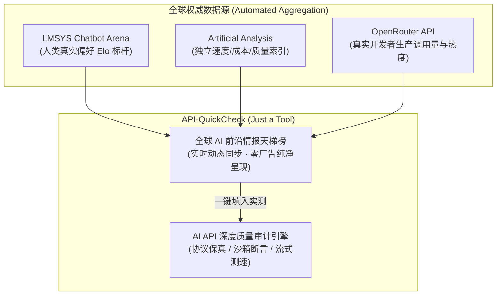

## 1. 平台定位与设计理念

随着大语言模型（LLM）与 Agentic AI 生态的极速演进，API 中转服务、企业网关与聚合路由层出不穷。市场上充斥着“劣质中转”、“偷换底层模型”、“虚假流式缓冲”、“截断长上下文”以及“丢失或伪造推理思考链”等欺诈与损耗现象。

与市面上打着评测旗号、满屏植入中转站返利推广（Affiliate Ads）与充值排名的商业站点不同，**API-QuickCheck 始终坚守 “Just a Tool” 的纯粹工具本性**：

* **零商业广告**：拒绝任何中转站返利推广、拒绝充值买榜，保持绝对的极客纯粹与客观中立；
* **全球权威前沿自动化聚合**：我们不重复造轮子去搞复杂的主观算分体系，而是通过自动化聚合引擎，实时爬取并同步全球公认最权威的三大源头（**LMSYS Chatbot Arena、Artificial Analysis、OpenRouter**）的最新排行与技术参数；
* **查榜与实测毫秒级联动**：用户在榜单上查阅最新模型特性的同时，可一键将目标模型载入本地工作台，直接对所用的第三方 API 接口发起真实质量审计与防伪对抗。

---

## 2. 核心功能与架构支柱

### 1. 全球前沿 AI 榜单自动化动态聚合
* **LMSYS Chatbot Arena (lmarena.ai)**：跟踪全球公认的人类真实盲测 Elo 战力评分；
* **Artificial Analysis (artificialanalysis.ai)**：同步权威的独立速度（TPS）、首字延迟（TTFT）、百万 Token 官方定价与上下文窗口；
* **OpenRouter Models API**：实时捕获全球开发者真实调用量与生产级模型热度趋势；
* **极简无广告呈现**：打破传统榜单分散、更新不同步、界面臃肿的痛点，在一个清爽的极客界面中一览无余。

### 2. 从“黑盒猜真伪”到“全景多维质量审计”
面对任何中转站或私有网关，提供四大维度的深度差分体检：
* **协议保真度 (P0)**：原生流式事件、严格结构化 JSON Schema、推理 Token 与元数据完整透传；
* **状态连续性 (P1)**：双回合函数工具调用（Function Calling）闭环回传检验，精准定位网关中间件缺陷；
* **能力一致性 (P2)**：Python 隔离沙箱多用例单元测试断言与 105K+ Tokens 大海捞针精准检索；
* **运行质量与稳定性 (P3)**：首字延迟 (TTFT)、生成吞吐 (TPS) 及网络抖动方差分析。

### 3. 纯前端无状态安全 (Zero-Data Retention)
安全是接口测试的底线。API-QuickCheck 采用纯前端客户端直连架构：
* **零服务端中转**：所有的 API 探测请求直接由用户的浏览器向目标 Base URL 发起，不经过任何第三方服务器中继；
* **内存即抛**：您的 API Key 与端点配置仅保存在本地浏览器内存中，页面刷新即销毁，绝不在任何数据库中持久化或上传；
* **企业网络合规**：天然支持内网专线与私有网关的连通性测试，不泄露任何企业网络拓扑。

### 4. 双模驱动：现代 Web 工作台 + 工业级无头 CLI
为了兼顾直观的交互分析与高并发自动化集成，平台原生提供双重运行模式：
* **现代 Web 交互工作台**：可视化的多维雷达图、审计证书导出、API Key 批量池化测活与全景知识文档；
* **无头 CLI 终端引擎 (`scripts/apiqc.ts`)**：零外部依赖、完美适配 CI/CD 流水线的命令行工具，天然突破浏览器 CORS 跨域限制，支持 `--fail-under` 门禁阻断与黄金基线快照持久化采集。

---

## 3. 开源与社区共建

API-QuickCheck 依托开源社区力量不断壮大。我们欢迎社区开发者、模型厂商与安全研究人员一同完善对抗性探针库与前沿指纹基准数据库。

* **GitHub 代码仓库**：[som1ng/API-QuickCheck](https://github.com/som1ng/API-QuickCheck)
* **开源协议**：采用宽松友好的 MIT 开源协议，支持企业与个人自由集成与二次开发。
