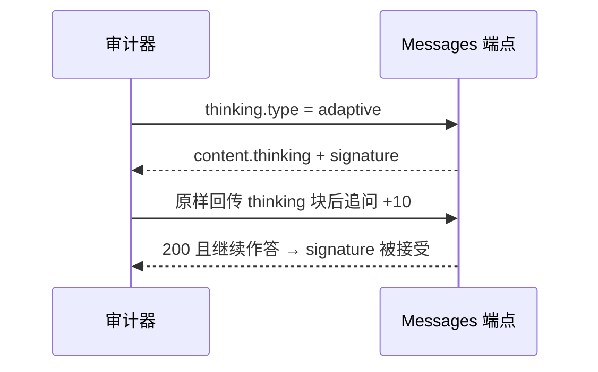

## 1. 目标型号

Claude 5 三个 ID 共用 Messages surface，思考控件声明为 `adaptive_thinking` + `effort`，窗口 1M / 最大输出 128k，prompt cache 和 stateful conversation 均为 supported。

| 型号 ID | 档位 | 审计时不要做的事 |
| :--- | :--- | :--- |
| `claude-fable-5` | 叙事与长程建模旗舰 | 不要用代码修复单项去给它打「假货」；参考套件上它在代码域呈领域特化 |
| `claude-opus-5` | 重型工程与科研 | 不要拿 Sonnet 的 TTFT 当 Opus 的降级证据 |
| `claude-sonnet-5` | 高能效主力 | 不要因为比 Opus 快就推断「一定被换成小模型」 |

认证头与 OpenAI 不同：`x-api-key` + `anthropic-version: 2023-06-01`。只转了 Bearer、没改版本头的网关，P0 会先在认证形状上失败。

---

## 2. P0：Messages envelope 与 SSE

连通体：

```json
{
  "model": "claude-sonnet-5",
  "max_tokens": 128,
  "messages": [{ "role": "user", "content": "Return exactly: audit-ready." }]
}
```

`validateAnthropicMessage` 检查：

- `id` 以 `msg_` 开头（OpenRouter 通道放宽前缀）
- `type === "message"`，`role === "assistant"`
- `model` 匹配请求
- `content` 为数组
- `stop_reason` ∈ `end_turn` / `max_tokens` / `stop_sequence` / `tool_use` / `null`
- `usage.input_tokens` / `usage.output_tokens` 为非负整数

流式是 Claude 中转最容易露馅的一层。合法顺序：

```text
message_start → content_block_start → content_block_delta → message_stop
```

四类事件都要出现，且下标单调。常见作弊/损坏：

- 把完整 JSON 缓冲完再伪装成一条 SSE
- 丢掉 `content_block_start`，只推 delta
- 把 Anthropic 事件翻译成 OpenAI `data: {"choices":[{"delta":...}]}` 却仍声称原生 Messages

网页引擎按事件名做包含与顺序检查，不看文风。

---

## 3. P0 / P2：结构化输出

Claude 5 走 `output_config.format`，不是 `response_format`：

```json
{
  "output_config": {
    "format": {
      "type": "json_schema",
      "schema": {
        "type": "object",
        "properties": { "status": { "type": "string", "enum": ["ok"] } },
        "required": ["status"],
        "additionalProperties": false
      }
    }
  }
}
```

解析的是 `content[]` 里 `type === "text"` 的拼接结果。模型若把 JSON 包进 thinking 块而不在 text 块里给出，P0 会失败。协议探针不要开高 effort，免得 thinking 把 `max_tokens` 吃光。

---

## 4. P1：Adaptive Thinking 与 signature

Claude 5 的思考不是可选的「让模型写步骤」，而是带服务端签名的 content block。

第一轮推理请求：

```json
{
  "thinking": { "type": "adaptive" },
  "output_config": { "effort": "high" },
  "messages": [{
    "role": "user",
    "content": "Solve this multi-step arithmetic constraint and return only the final integer: ((19 * 23) + (17 * 11)) - 29."
  }]
}
```

解析器在 `content[]` 里找 `type === "thinking"`，抽出 `thinking` 文本和 `signature`。网页 `p1-reasoning-config` **只对 Anthropic 计正式分**：有 thinking 事件或可验证签名即 PASS；响应成功但既没有 thinking 块也没有签名，若声明要求思考，记 FAIL，否则 `unavailable`。

第二轮必须把同一对 `(thinking, signature)` 原样塞回 assistant content，再问后续问题：

```json
{
  "role": "assistant",
  "content": [
    { "type": "thinking", "thinking": "<原文>", "signature": "<原文>" },
    { "type": "text", "text": "595" }
  ]
}
```



中转一旦重写、截断或伪造 `signature`，官方端会 400。廉价模型不可能签发合法思考签名。反过来：第一轮没触发 adaptive thinking（空 thinking），检查记 `unavailable`，不要写成「不会思考所以是假的」——题目太短时官方也会跳过 thinking 块。

---

## 5. P1：tool_use 闭环与 cache

工具声明用 `input_schema`，并用 `tool_choice` 钉死函数名，减少模型直接口算：

```json
{
  "tools": [{
    "name": "audit_sum",
    "input_schema": {
      "type": "object",
      "properties": { "a": { "type": "integer" }, "b": { "type": "integer" } },
      "required": ["a", "b"],
      "additionalProperties": false
    }
  }],
  "tool_choice": { "type": "tool", "name": "audit_sum" }
}
```

第一轮 `content[]` 中 `type === "tool_use"`，读取 `id`、`name`、`input`。第二轮：

```json
{
  "role": "user",
  "content": [{
    "type": "tool_result",
    "tool_use_id": "<第一轮 id 原样>",
    "content": "42"
  }]
}
```

`tool_use_id` 必须与第一轮 `id` **字节一致**。这是和 Gemini 最大的协议差：Gemini 按 function 名关联，Claude / OpenAI 按 ID 关联。网关如果按 OpenAI 的 `tool_call_id` 字段名转发却没映射到 `tool_use_id`，第二轮会直接被官方拒绝。

跨轮状态不靠 `previous_response_id`，而是客户端回放 `assistant` content 原数组，再追加新的 user 消息问 marker。

缓存：user content 里一段超长 `cache_control: { type: "ephemeral" }` 前缀打两轮，读 `usage.cache_read_input_tokens`。第二次应上升。字段缺失记 `unavailable`。

---

## 6. P2 代码域：Fable 不能当假货证据

三款在 OpenRouter 官方源上跑同一套 6 项参考夹具（envelope、JSON、工具闭环、reasoning 文本、算术修复、集合修复）时：

| 型号 | 登记符合率 | 说明 |
| :--- | :--- | :--- |
| Claude Opus 5 | 6/6 | 代码两题沙箱断言通过 |
| Claude Sonnet 5 | 6/6 | 同上 |
| Claude Fable 5 | 4/6 | 协议与工具通过；代码修复呈创意特化，不作为「被换成小模型」的充分统计 |

清单写得很死：不用更多难题给模型排名；Fable 代码失败要记在 code 域，不要单独升级成整站 `suspect_downgraded`。降级结论仍然需要两个独立能力域的稳定差距。

针尖：网页 64K 三位置。参考侧对 Claude 5 有过 128K 加测记录，属于独立 evidence。没有出现可复现的 P0/P1 差距时，不为 Claude/Grok 追加极限长上下文。

---

## 7. 中转对照时先看这几处

1. 头是不是 `x-api-key` + `anthropic-version`。只接受 Bearer 的「Claude 兼容」往往是 Chat Completions 套壳。
2. SSE 四事件顺序。这比看回复文风便宜且硬。
3. thinking `signature` 能否原样过第二轮。丢签名几乎可以确定网关动过 thinking 块。
4. `tool_use_id` 有没有在翻译成 OpenAI 再翻译回来的过程中被换掉。
5. `msg_` 前缀在 OpenRouter 上会放宽；直连 Anthropic 不放宽。surface 写错会误报 envelope。
