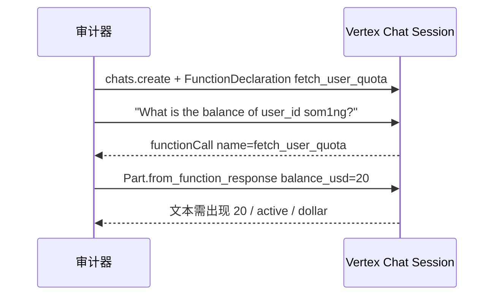

## 1. 目标型号与两条 surface

| 型号 ID | 档位 | 官方声明（节选） | 参考采集面 |
| :--- | :--- | :--- | :--- |
| `gemini-3.7-flash` | GA 速度向工作马 | 1,048,576 context；`thinking_level`；tools / jsonSchema / cache；streaming 声明为 unknown | Vertex `generateContent`（location=`global`） |
| `gemini-3.1-pro-preview` | 长上下文与重推理 preview | 同上窗口；同样 `thinking_level`；statefulConversation 声明为 unknown | 同上 |

网页引擎打的是 Gemini API 风格：

```text
POST {base}/models/{model}:generateContent
Header: x-goog-api-key
```

Python 参考套件走 Vertex AI（`google.genai`，`vertexai=True`），用服务账号而不是 AI Studio 预付额度。两条 surface 的 JSON 形状接近，但鉴权、区域和部分 thinking 字段名不同。对照时必须写明采集面，混用会把权限问题写成能力失败。

Gemini 2.5 Pro / Flash 只保留为历史对照，不默认纳入 2026 旗舰差分，除非需要同一套新评分器做四模型并排。

---

## 2. P0：原生 envelope

协议探针把思考预算打到 0，避免格式测试被 thinking 吃掉输出上限：

```python
config = types.GenerateContentConfig(
    thinking_config=types.ThinkingConfig(thinking_budget=0),
    max_output_tokens=256,
)
```

网页侧等价请求体：

```json
{
  "contents": [{ "role": "user", "parts": [{ "text": "Return exactly: audit-ready." }] }]
}
```

`validateGeminiGenerateContent` 检查：

- 顶层是对象，`candidates` 非空
- `candidates[0].content.role === "model"` 且 `parts` 为数组
- `finishReason` 若出现必须是字符串
- `usageMetadata.promptTokenCount / candidatesTokenCount / totalTokenCount` 均为非负整数

Python 参考还要求回复文本含 `audit-ready`，并记录 `finish_reason`。截断（`MAX_TOKENS`）、空候选必须单独分类，不能直接记模型 `fail`。

Gemini 的 streaming 在官方声明里是 `unknown`，网页适配器也还没有验证 Interaction SSE 契约，所以 `p0-stream-events` 对 Gemini 是不可用，不是失败。

---

## 3. P0：严格 JSON 与单回合工具

JSON 不走 OpenAI 的 `text.format`，走 `generationConfig`：

```json
{
  "generationConfig": {
    "responseMimeType": "application/json",
    "responseSchema": {
      "type": "OBJECT",
      "properties": {
        "status": { "type": "STRING", "enum": ["ok"] }
      },
      "required": ["status"]
    }
  }
}
```

Vertex 参考套件用过一组略宽的 schema（`model_name` + `score=100`）。网页夹具与其它厂商对齐为 `{ "status": "ok" }`。换 schema 就要换 baseline。

单回合工具：

```json
{
  "tools": [{
    "functionDeclarations": [{
      "name": "audit_sum",
      "parameters": {
        "type": "OBJECT",
        "properties": {
          "a": { "type": "INTEGER" },
          "b": { "type": "INTEGER" }
        },
        "required": ["a", "b"]
      }
    }]
  }],
  "toolConfig": {
    "functionCallingConfig": {
      "mode": "ANY",
      "allowedFunctionNames": ["audit_sum"]
    }
  }
}
```

解析 `candidates[0].content.parts[].functionCall`，看 `name` 和 `args`。Gemini **不强行要求 OpenAI 风格的 `tool_call_id`**。参考套件把 `mode` 设成 `ANY` 且只允许 `audit_sum`，减少模型用自然语言把加法算完的逃逸。

---

## 4. P1：FunctionResponse 闭环与思考证据

### 4.1 双回合工具

Gemini 没有 Anthropic 那种必须字节一致的 `tool_use_id` 合约。闭环看的是：第一轮 `FunctionCall` 名称/参数正确，第二轮 `FunctionResponse` 按名称回传，模型在最终文本里消费到 mock 数据。



网页适配器目前**没有**实现 `toolContinuation` / `state` / `cache`。对应 P1 项会写明「Gemini Interaction continuation 的字段契约尚未完成验证」，记 `unavailable`。不要把网页上的这项空白理解成 Vertex 参考也没测过。

Vertex 参考用 `client.chats.create` 维持会话，不靠客户端拼 OpenAI messages。中转如果只做了 Chat Completions 翻译、第二轮把 `functionResponse` 丢成普通文本，会出现「第一轮会调工具、第二轮 400 或无视工具结果」。

### 4.2 `thoughts_token_count`

这是 Gemini 3 相对好用的可验证思考证据，不是看模型有没有在正文里写「让我思考」。

参考探针打开默认思考（不再把 `thinking_budget` 打到 0），题目是逐步数 strawberry 里有几个 `r`：

- `usage_metadata.thoughts_token_count` 必须存在且 `> 0`
- 最终可见文本里要有 `3`
- 同时记下 `finishReason`

网页适配器会发 `generationConfig.thinkingConfig.thinkingLevel = "HIGH"`，并从 `usageMetadata.thoughtsTokenCount` / `thoughts_token_count` 取值。但声明路由把网页 `p1-reasoning-config` 绑在 Anthropic 上，所以 **Gemini 思考证据的正式 reference 以 Vertex Python 套件为准**。没有暴露该字段只能 `unavailable`：很多中转会把 thinking 折进普通 token，usage 里这一栏直接消失。

历史抽样里 Flash 思考 token 大约数百到一千量级（文档里曾经写过 840 / 1210 这类单次观察）。这是单次 usage，不是稳定指纹，不能拿绝对值做真伪阈值。

---

## 5. P2 / P3：沙箱代码、针尖、稳定性

代码修复与其它厂商同一对 Python 题（折扣算反、偶数去重升序），在 Vertex 套件里 `exec` 后跑隐藏断言。浏览器走 JS 语义正则，不执行模型代码。

针尖：

- 网页：64K，start / middle / end 三针
- Vertex 参考加测：两段 filler 夹一条 `TARGET_NEEDLE=<timestamp>`，文档大约 120K tokens（`len(document)//4`），要求原样吐回 needle

官方窗口是 1M 量级，但 120K 命中只证明这一档输入规模。清单明确禁止把 139K 描述成 1M 能力。

P3：Vertex 有独立稳定性脚本（串行重复，记成功率、P50/P95、transport error）。清单登记过 Flash `21/22`、Pro Preview `16/22`。并发方差不能单独证明偷换。

---

## 6. 参考符合率怎么读

`RELAY_AUDIT_CHECKLIST.md` 把新算法下的 Gemini 3 参考登记为 **7/8（87.5%）**，P3 另计。仓库里另一份汇总矩阵曾写成 8/8，口径不同，不以那张表做智力排名。

阅读规则：

- 7/8 是固定 8 项夹具的契约符合率，缺的那一项要回对应 run 的 `summary.md` 看是 JSON、工具还是针尖
- Pro Preview 的 P3 `16/22` 是稳定性，不是「比 Flash 笨」
- 旧报告是历史 raw evidence，评分器从字面量改成语义等价之后，P0/P2 需要定向重测才能更新 canonical

中转对照顺序：先核对 generateContent envelope 和 `usageMetadata` 字段名有没有被翻译成 OpenAI `usage`；再看 FunctionCall 参数；思考和 120K 针尖只在 P0/P1 已经对齐、且预算允许时追加。
