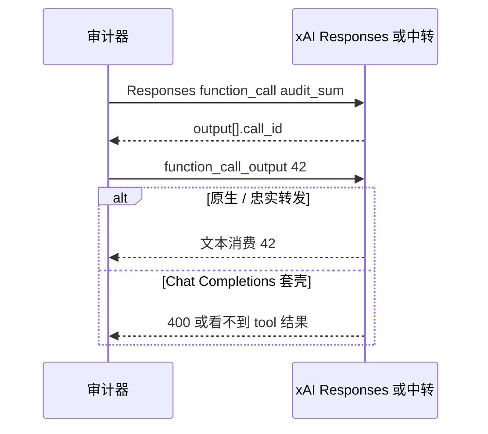

## 1. 目标型号

| 型号 ID | 档位 | 官方声明（节选） | 优先 surface |
| :--- | :--- | :--- | :--- |
| `grok-4.6` | 全模态实时 Agent | 500,000 context；tools / jsonSchema / cache / vision；reasoning 为 supported，但 `reasoningControls` 为空；statefulConversation 与 streaming 为 unknown | Responses |

网页引擎把 xAI 和 OpenAI 编进同一套 Responses 适配器：`Authorization: Bearer`，路径 `/responses`，解析 `output[]` 里的 `function_call`。这意味着 **P0 envelope、strict JSON、工具结构、previous_response_id 回传、64K 针尖、JS 代码修复的请求形状与 GPT-5.6 相同**。真伪差不在另一套私有协议，而在声明路由、思考证据怎么采、以及必须使用 `grok-4.6` 自己的 reference 快照。

OpenRouter 参考套件对 Grok 走 Chat Completions（`x-ai/grok-4.6`），那是采集面，不是 xAI 原生合约。和直连 `api.x.ai` 的 Responses 结果不能直接当同一 surface 相减。

---

## 2. 声明路由和 OpenAI 的差

`probe-policy.json` 按 claims 跳探针，不按「Grok 看起来像 GPT」开打。

| 字段 | grok-4.6 | 对探针的影响 |
| :--- | :--- | :--- |
| `contextWindowTokens = 500000` | 高于 64K 阈值 | 三针长上下文会执行 |
| `reasoningControls = []` | 官方没给出可调档位列表 | 不要把 `reasoning.effort = xhigh` 当成硬合约；控件被拒可能是声明如此 |
| `statefulConversation = unknown` | 未明确 | `p1-state-continuity` 走探索或跳过，失败不升官方降级 |
| `streaming = unknown` | 未明确 | 流式顺序作探索项；缺失事件优先 `unavailable` |
| `promptCaching = supported` | 支持 | 两次相同前缀应能读到 cached token；字段被中转抹掉才是协议问题 |
| `toolCalling / jsonSchema = supported` | 支持 | 工具闭环和 strict JSON 计入正式分 |

适配器仍会发 `reasoning: { effort: "high" }`，因为 Responses 形状允许。这是探测「参数是否被静默丢弃」，不是要求 Grok 必须暴露和 Claude 一样的 thinking 块。没有可验证 reasoning 字段时记 `unavailable`。

Python 参考用同一道 strawberry 字母题，看可见答案是否含 `3`，并记录 `reasoning_content`。有文本答案但没有 reasoning 字段，只能说明「这道题算对了」，不能写成「原生思考链 100% 捕获」。

---

## 3. P0 / P1：沿用 Responses，盯翻译层

连通、JSON、工具第一轮与 GPT-5.6 相同夹具：`audit-ready.`、`status=ok`、`audit_sum(19, 23)`。

第二轮同样走：

```json
{
  "previous_response_id": "resp_...",
  "input": [{
    "type": "function_call_output",
    "call_id": "<第一轮 call_id>",
    "output": "42"
  }]
}
```



中转把 Grok 接到 OpenAI 兼容层时，常见损坏和 GPT 一样：丢掉 `function_call_output`、把 `call_id` 改写成自己的 UUID、`object` 变成 `chat.completion`。额外多一个坑：有的网关用 `grok-4` / `grok-2` 别名顶 `grok-4.6`，envelope 的 `model` 字段对不上请求 ID，P0 直接 `model_mismatch`。

若目标只提供 Chat Completions，应显式按 OpenRouter 适配器测，并使用对应 surface 的 baseline。混用 Responses reference 去减 Chat Completions relay，结论只能 `inconclusive`。

---

## 4. P2 / P3：代码、针尖、稳定性

代码修复与其它厂商同一对题。OpenRouter 官方源上 Grok 4.6 在 6 项参考夹具（envelope、JSON、工具闭环、reasoning 文本、两道沙箱代码）登记为 **6/6**。这是契约符合率。

针尖：

- 网页：64K × 3 位置，marker `FIXED_CONTEXT_MARKER: needle-answer-...`
- 参考加测：约 128K 文档命中，端到端大约 5.5s

官方窗口是 500K。128K 命中不能写成「50 万上下文已验证」。清单也不为 Grok 追加极限上下文，除非中转明确声称更长窗口，并且 P0/P1 已经对齐、预算和停止条件都写清。

P3 与 OpenAI 相同：四次重复连通，可选并发分档。Grok 实时检索/代码执行沙箱是官方产品能力；本项目的受控夹具**不**打开联网搜索，只验证函数签名和本地代码修复，避免把外部检索噪声写进 baseline。

---

## 5. 中转对照时先看这几处

1. `model` 回显是不是 `grok-4.6`。别名映射必须写进报告，不能默默当成正品 ID。
2. 实际 surface。声称 xAI 原生却只活在 `/chat/completions`，P1 的 `previous_response_id` 会整段缺失。
3. `usage` 里 cached token 还在不在。声明支持 cache 但 usage 被抹平，记协议问题，不记「Grok 不会缓存」。
4. 不要用 GPT-5.6-Sol 的 baseline 减 Grok。同构适配器不等于同一条参考分布。
5. 思考档位被拒：先查 `reasoningControls` 是否本来就是空的，再决定这是中转丢参还是官方未提供该旋钮。
