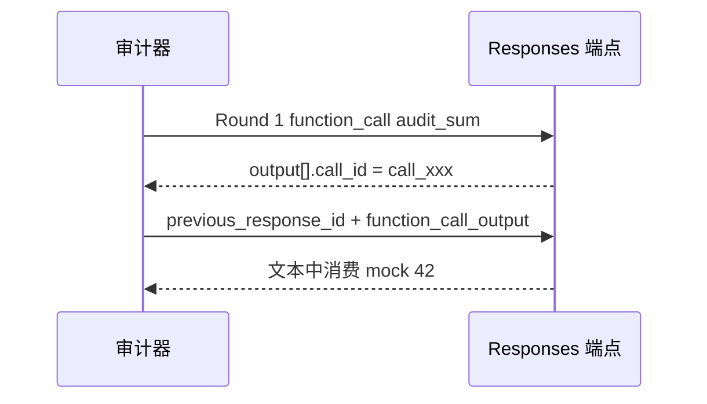

## 1. 目标型号

OpenAI 2026 旗舰按档位拆，不能把其中一档的分数拿去证明另一档「缩水」。

| 型号 ID | 档位 | 官方声明（节选） | 优先 surface |
| :--- | :--- | :--- | :--- |
| `gpt-5.6-sol` | 旗舰推理与代码 | 1,050,000 context / 128,000 max output；reasoning `effort`；tools / json_schema / cache | Responses |
| `gpt-5.6-terra` | 均衡工作马 | 同上窗口；同样支持 tools、structured output、stateful conversation | Responses |
| `gpt-5.6-luna` | 高吞吐低延迟 | 同样窗口；`reasoningControls` 在声明表里为空，思考相关探针按声明路由跳过或作探索项 | Responses |

中转站经常只暴露 Chat Completions。网页引擎对 OpenAI / xAI 默认打 `/responses`；对 OpenRouter 和明确的兼容网关走 `/chat/completions`。surface 不一致时，结论只能是 `inconclusive`，不能写成假冒。

---

## 2. P0：Responses envelope 与路由

连通夹具：

```json
{ "model": "gpt-5.6-sol", "input": "Return exactly: audit-ready." }
```

合法响应至少满足：

- `id` 以 `resp_` 开头
- `object === "response"`
- `model` 与请求型号匹配（允许包含关系，兼容带前缀的别名）
- `output` 为数组
- `status` 若出现，只能是 `completed` / `incomplete` / `failed`
- 文本侧能匹配到 `audit-ready`

Chat Completions 对照校验更严：`id` 以 `chatcmpl-` 开头（OpenRouter 放宽）、`object=chat.completion`、`choices[0].message.role=assistant`、`usage.prompt_tokens / completion_tokens / total_tokens` 均为非负整数。

很多中转会把 Responses 请求翻译成 Chat Completions 再包回来。典型失败不是「模型笨」，而是：

- 返回 HTML 网关页或非 JSON
- `object` 变成 `chat.completion` 却挂在 `/responses` 路径上
- `model` 字段被改写成网关内部别名且对不上请求 ID

流式（Responses SSE）必须同时出现 `response.created`、文本 delta（`response.output_text.delta` 或 `response.content_part.added`），并且 `response.completed` / `response.done` 的下标晚于 delta。先缓冲完整后再一次性推一个 `done`，会在这一项上暴露。

---

## 3. P0：严格 JSON Schema

Responses 请求把格式放在 `text.format` 里，而不是旧的 `response_format`：

```json
{
  "model": "gpt-5.6-sol",
  "input": "Return a JSON object with exactly one property named status and value ok.",
  "text": {
    "format": {
      "type": "json_schema",
      "name": "audit_status",
      "strict": true,
      "schema": {
        "type": "object",
        "properties": { "status": { "type": "string", "enum": ["ok"] } },
        "required": ["status"],
        "additionalProperties": false
      }
    }
  }
}
```

判定：HTTP 成功，且 `JSON.parse(output_text).status === "ok"`。缺字段、多字段、`"OK"` 大小写不对、包一层 markdown 代码块，都是 FAIL。

中转若剥掉 `strict: true` 改成普通 `json_object`，弱模型经常会多吐解释性键。协议探针本身把 thinking 预算关掉或压到很小，避免把格式测试变成推理测试。

Chat Completions 兼容面使用：

```json
"response_format": {
  "type": "json_schema",
  "json_schema": { "name": "audit_status", "strict": true, "schema": { "...": "同上" } }
}
```

Python 参考套件对部分 OpenRouter 通道会在 `response_format` 被拒后降级为 `json_object` 再解析。降级成功只能说明「还能吐 JSON」，不能记成 strict schema PASS。

---

## 4. P1：工具闭环与状态

### 4.1 工具结构

Responses 工具声明是扁平 `type: "function"`，带 `strict: true`，不是 Chat Completions 的 `tools[].function` 嵌套：

```json
{
  "tools": [{
    "type": "function",
    "name": "audit_sum",
    "parameters": {
      "type": "object",
      "properties": { "a": { "type": "integer" }, "b": { "type": "integer" } },
      "required": ["a", "b"],
      "additionalProperties": false
    },
    "strict": true
  }],
  "input": "Call audit_sum with a=19 and b=23. Do not answer in prose."
}
```

解析器在 `output[]` 里找 `type === "function_call"`，读取 `call_id` / `name` / `arguments`。参数必须是整数 19 和 23，字符串 `"19"` 不算过。

### 4.2 第二轮回传



第二轮不重放整段 messages，而是：

```json
{
  "model": "gpt-5.6-sol",
  "previous_response_id": "resp_...",
  "input": [{
    "type": "function_call_output",
    "call_id": "call_xxx",
    "output": "42"
  }]
}
```

Chat Completions 中转走另一条路：把第一轮 assistant `tool_calls` 原样塞回 messages，再追加 `{ "role": "tool", "tool_call_id": "...", "content": "42" }`。`tool_call_id` 必须与第一轮字节一致。网关如果把 tool 消息拼成普通 user 文本，第二轮常直接 400，或模型开始「重新计算 19+23」而看不到 42——这是 P1 中间件缺陷。

### 4.3 跨轮状态与缓存

- 状态：第一轮 `store: true` 记下 `STATE_MARKER_<model>`；第二轮只传 `previous_response_id`，要求原样回显 marker。
- 缓存：同一长前缀打两轮，读 `usage.input_tokens_details.cached_tokens`。第二次应高于第一次。字段缺失记 `unavailable`，不记「不会缓存」。

`reasoning.effort = "high"` 写在适配器里，但声明路由把网页侧 `p1-reasoning-config` 绑在 Anthropic 上。GPT-5.6 的思考证据由 Python 参考套件采：strawberry 字母计数题看最终答案是否含 `3`，并记录 `reasoning_content` / `reasoning_tokens` 是否暴露。没暴露 usage 字段只能 `unavailable`，除非该 surface 把该字段写成硬合约。

---

## 5. P2 / P3：代码、针尖、重复样本

浏览器代码夹具是 JS，不是 Python：

- A：`totalWithTax` 写成了 `price + taxRate`，验收允许 `price * (1 + taxRate)` 或等价展开
- B：`unique` 写成了 `values.sort()`，验收允许 `new Set(values)` 一类保序去重

Python 参考套件用另一对函数（折扣算反、奇数过滤冒充偶数去重），在内存作用域里跑数值断言。Sol / Terra / Luna 在 OpenRouter 官方源的 6 项参考夹具上登记为满分通过；GPT-5.6 变体在清单里另有 8/8 的官方直连记录。这些数字是**固定夹具契约符合率**。

长上下文：网页三针（start / middle / end）各约 64K。Python 侧对 GPT-5.6 做过约 105K 文档的加测，Sol / Terra / Luna 均命中，端到端大约 3.8s–5.2s。那是加测，不能用来宣称「1,050,000 窗口已测满」。

P3：网页重复打四次连通夹具，汇总成功率与 P50/P95。Python 中转审计另有并发 5 的压力针，5 次里至少 4 次回出 `pong-<i>` 才过。延迟方差只是风险信号，单独不能证明偷换模型。

---

## 6. 中转对照时先看这几处

1. 有没有把 `/responses` 静默改成 `/chat/completions`，同时丢掉 `previous_response_id`。
2. `strict: true` 是否还在；剥掉之后 JSON 仍然能 parse，但 extra keys 会在 P0 爆出来。
3. 第二轮 `function_call_output` / `role: tool` 是否 400。这是 OneAPI 类网关最常见的坑。
4. `usage` 是否还分得出 `reasoning_tokens` 和 `cached_tokens`。整段 usage 被抹平，思考和缓存两项只能 `unavailable`。
5. Sol / Terra / Luna 必须分开建 baseline。Luna 更快不构成 Terra 被降级的证据。
