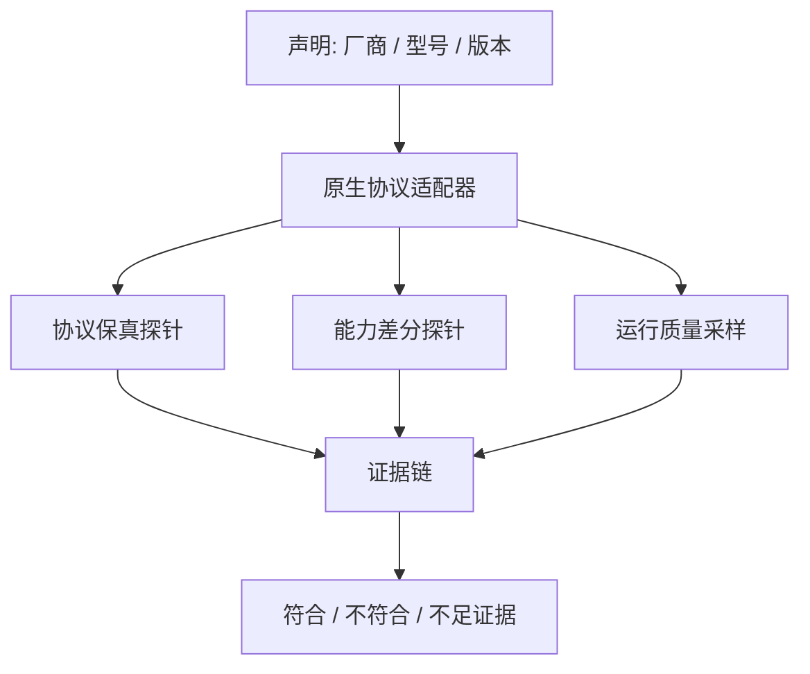

## 1. 审计目标与边界

API-QuickCheck 审计的是**某个端点对其声明模型与能力的符合程度**，不是从单次文本回答中“证明模型来源”。除非厂商提供可独立验证的来源证明，黑盒测试只能给出带置信度的证据，不应输出“100% 官方正品”。

报告必须拆分为三个独立结论：

| 结论层 | 回答的问题 | 不能回答的问题 |
| :--- | :--- | :--- |
| **协议保真** | 原生请求、事件流、工具和参数是否被正确转发 | 底层究竟是哪一个模型 |
| **能力一致性** | 目标端点在可复现实验中是否接近同版本官方基线 | 代理的地区、服务等级或负载原因 |
| **运行质量** | 上下文、延迟、稳定性、usage 与计费是否符合声明 | 模型身份 |



## 2. 版本化参考基线

每一个 `provider + model_id + API surface + region + service tier` 都是独立基线。基线必须来自同日或近似日期的官方端点，记录：请求 JSON、完整事件序列、功能声明、模型快照、随机种子、响应与费用。

不要把以下项目当作身份指纹：回答文风、幽默程度、Tokenizer 估算、固定 TPS 阈值、知识截止日期或“是否自称某模型”。它们都容易被系统提示、联网工具、地区负载和网关缓存改变。

## 3. 探针分层

### P0：声明与原生协议

验证 Models API 元数据、实际路由、认证头、请求字段、错误码、SSE/Responses/Interactions 事件顺序、工具调用 ID 与严格 JSON Schema。P0 失败说明**兼容性或透传问题**，不自动说明模型造假。

### P1：参数与状态连续性

随机化并成对对比 `reasoning_effort` / `thinking_level` / adaptive thinking、缓存、跨轮会话、工具回传、拒答和中止状态。须保留厂商规定的不透明思考签名；签名连续可作为协议证据，但不是客户端身份认证。

### P2：能力差分

对目标端点、官方基线和若干负样本同时运行动态题集：受控工具闭环、代码补丁与测试、长上下文多位置检索、图像/图表理解、约束 JSON。任务有确定性评分器，题目参数、针尖位置和工具返回值由每次运行随机生成。

### P3：运行质量

按地区、时段和并发级别采集 TTFT、流式间隔、成功率、p50/p95 延迟、可接受上下文上限与 usage。网络性能只作为运行质量，不可用来直接判断模型身份。

## 4. 统计与判定

对每个能力任务记录成功/失败及连续分数，使用配对随机化检验或 bootstrap 置信区间报告目标与官方的差值；对通过率使用二项置信区间。避免对相关、非正态的单次响应直接套用 t-test。

建议结论格式：

```text
协议保真：通过（Responses + 严格 JSON + 工具事件完整）
能力一致性：不足证据 / 与 GPT-5.6 Sol 基线差 3.1pp（95% CI: -1.2, 7.4）
运行质量：上下文上限未达到声明；p95 TTFT 高于基线
总评：不能确认型号；发现的具体损耗为……
```

只有在“同版本官方基线显著优于目标”且排除配额、地区、服务层级与工具可用性后，才能标为**疑似能力降级**。协议不支持、样本量不足或厂商未公开该功能时，结论必须是**不足证据**。

## 5. Probe DSL 示例

```yaml
id: openai_responses_tool_roundtrip_v1
target:
  provider: openai
  model: gpt-5.6-sol
  surface: responses
randomization:
  seed: "{{RUN_SEED}}"
request:
  tools: [deterministic_calculator]
  require_strict_schema: true
assert:
  - response_event_sequence_is_valid
  - tool_arguments_validate_against_schema
  - tool_result_changes_final_answer
scoring:
  kind: paired_task_score
  repetitions: 12
  verdict_on_missing_feature: inconclusive
```

## 6. 当前范围

本套文档以 2026-08-16 的 OpenAI GPT-5.6、Claude Fable/Opus/Sonnet 5、Gemini 3 与 Grok 4.6 为基线。具体型号与官方资料见「简介 → 2026 前沿模型基线」。
