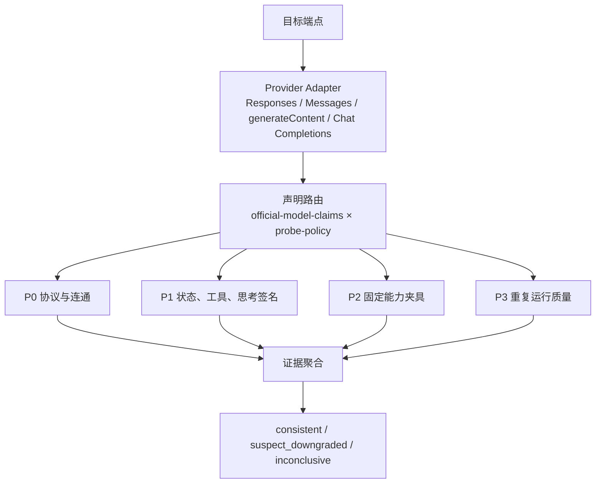
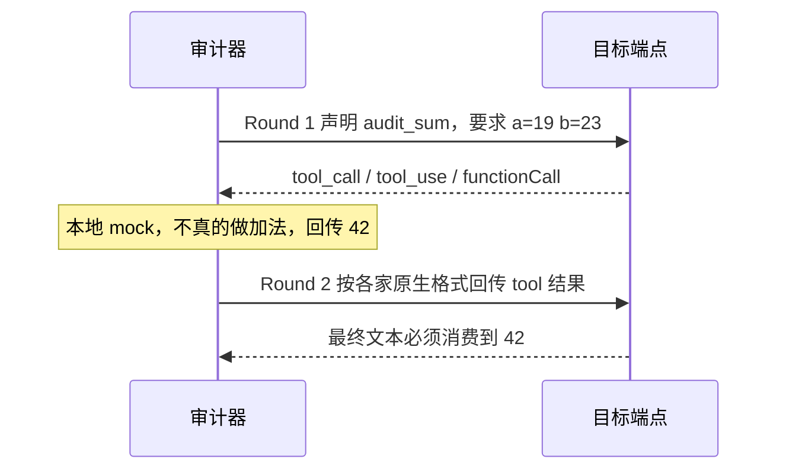

## 1. 审计在测什么

API-QuickCheck 只回答两个问题：

1. 这个 API surface 有没有完整、稳定地提供它声明的协议和能力。
2. 目标中转站与同模型、同版本、同 surface 的 reference 行为，在固定夹具上是否可复现地一致。

reference 只能说明「在本项目冻结夹具上的可观察行为」。它不是厂商身份认证，也不是理论能力上限，更不是模型智商排名。某个型号在 6/6 夹具上全部通过，只表示它满足当前合约；不能据此说它比 4/6 的型号「聪明 50%」。

判定依据是请求/响应结构、固定断言和重复样本，不是模型自我介绍、固定 TPS 阈值，也不是文风猜测。



两条执行路径共用同一套分层和夹具语义，实现细节不同：

| 路径 | 入口 | 用途 |
| :--- | :--- | :--- |
| 浏览器 / CLI 运行时 | `src/engine/audit` | 用户对中转站做实时对照；代码修复走语义正则，不在浏览器里 `eval` 模型代码 |
| Python 参考套件 | `agent_workspace/*测试方法` | 官方或权威源上采集 canonical reference；代码修复在隔离作用域里跑多组断言 |

---

## 2. 四层探针与 24 项平衡档计划

平衡档（`balanced` / `deep`）共 24 个逻辑用例。快速档只跑连通、认证、严格 JSON 和工具结构。P0 失败时停止拿能力去跟 reference 比，先归类为协议、权限、额度或中转问题。

| 层 | 探针 ID | 验证什么 | 评分器 |
| :--- | :--- | :--- | :--- |
| P0 | `p0-model-discovery` | `/v1/models` 或原生目录是否露出目标型号 | metadata |
| P0 | `p0-native-route` | 原生路由 + envelope + 固定回复 `audit-ready.` | http-status / envelope |
| P0 | `p0-auth-shape` | Bearer / `x-api-key` 被接受，401/403 语义可分 | http-status |
| P0 | `p0-stream-events` | SSE 事件类型齐全且顺序合法 | event-order |
| P0 | `p0-strict-json` | `strict` JSON Schema，输出恰好 `{ "status": "ok" }` | json-schema |
| P0 | `p0-tool-shape` | 调用 `audit_sum(a=19, b=23)`，结构合法 | tool-schema |
| P0 | `p0-invalid-parameter` | 非法采样参数应被原生拦截 | error-contract |
| P1 | `p1-reasoning-config` | 思考/推理配置被透传，且出现可验证证据 | parameter-response |
| P1 | `p1-state-continuity` | 第二轮读回第一轮 marker | continuation |
| P1 | `p1-tool-roundtrip` | 首轮工具调用，次轮消费 mock 结果 `42` | tool-result-consumption |
| P1 | `p1-signature-continuity` | Anthropic thinking `signature` 原样回传 | opaque-signature |
| P1 | `p1-cache-semantics` | 第二次相同前缀请求的 cached token 上升 | cache-consistency |
| P2 | `p2-constraint-json` | 约束 JSON 任务（与 P0 同夹具，计入能力域） | deterministic-json |
| P2 | `p2-tool-planning` | 再跑一轮工具闭环，作为规划能力样本 | tool-result-consumption |
| P2 | `p2-code-repair-a` | 算术模块缺陷修复 | patch-hidden-test |
| P2 | `p2-code-repair-b` | 集合/去重模块缺陷修复 | patch-hidden-test |
| P2 | `p2-chart-extraction` | 图表字段提取（需真实图片 fixture） | vision-fields |
| P2 | `p2-context-start/middle/end` | 约 64K tokens 针尖，分别埋在开头/中部/结尾 | needle-conflict |
| P3 | `p3-repeat-a/b/c/d` | 重复样本成功率、P50/P95 | latency-success |

浏览器当前故意不跑 `p0-invalid-parameter`（避免对真实端点发破坏性请求）。视觉探针没有真实图片 fixture 时记 `unavailable`，不记能力失败。Gemini 的流式、跨轮状态、工具回传、缓存字段在网页适配器里尚未完成契约验证，对应项会标不可用而不是伪造失败。

---

## 3. 声明路由：先问官方有没有声称

探针不是对所有模型无差别开打。`official-model-claims.json` 记录每个型号官方声明的能力；`probe-policy.json` 用 `requires` / `skipWhen` 决定这项探针怎么计分。

| 声明状态 | 处置 | 计分 |
| :--- | :--- | :--- |
| `supported` | `standard_benchmark`，执行 | 计入 reference / 降级判定 |
| `unsupported` | `not_claimed`，跳过 | 不扣分 |
| `unknown` | `exploratory_test`，可选执行 | 只作洞察，不参与官方级降级定论 |

典型规则：

- 长上下文针尖要求 `contextWindowTokens >= 64000`；窗口未知或不足则跳过。不得把 64K / 139K 实测写成「验证了 1M 能力」。
- `p1-signature-continuity` 和网页侧的 `p1-reasoning-config` 绑定 Anthropic Messages thinking。OpenAI / Gemini / Grok 的思考证据由 Python 参考套件单独采 `reasoning_tokens` / `thoughts_token_count`。
- 官方未声明的能力失败，记 `unavailable`，不写成「模型变笨」。
- 额度、限流、超时、网关 5xx，记 `unavailable`。返回可解析响应但固定断言不通过，才记 `fail`。
- `max_output_tokens` 截断、空候选、不完整 stream 单独分类，不直接记能力失败。

---

## 4. 三态评分与中转结论

每条证据只有三种状态：`pass` / `fail` / `unavailable`。样本不足、reference 缺失或版本不一致时，整次审计结论是 `inconclusive`。

中转站**不**输出「这就是某模型」的绝对认证，只输出：

| 结论 | 含义 |
| :--- | :--- |
| `consistent` | 协议和适用能力与 reference 一致，重复样本没有显著退化 |
| `suspect_downgraded` | 至少两个独立能力域出现稳定、可复现的 reference 差距，或有明确路由/字段降级证据 |
| `inconclusive` | 样本、surface、版本、额度或权限不足，证据撑不起真假结论 |

能力域对照用 bootstrap 差分，不用单次分数拍脑袋。对目标样本 $\mathbf{x}$ 和基线样本 $\mathbf{y}$：

$$
\Delta = \bar{x} - \bar{y}
$$

用审计 seed 做确定性伪随机，对两组样本各做 2000 次有放回重采样，取差分分布的 2.5% / 97.5% 分位作为 95% 区间。若某个能力域的区间上界 $\le -0.15$（目标比基线低至少 15 个百分点，且 95% 区间不跨过该阈值），该域记为退化。**两个及以上独立域**同时退化，才升为 `suspect_downgraded`。单域波动或没有基线快照，只能是 `inconclusive`。

可选的展示分数只用于「relay conformance」，不是模型能力分：

- 协议完整性 30%
- 结构化输出与工具闭环 30%
- 声明能力证据（reasoning / state / signature / cache）20%
- 重复稳定性与 transport quality 20%

代码、上下文、视觉作为独立维度展示，不压进排行榜。任何综合分都必须同时给出原始通过率、样本数和 `unavailable` 原因。

HTTP 归类（运行时）：

- 请求成功且断言通过 → `pass`
- 401 / 403 → 认证 `fail`
- 0 / 402 / 404 / 405 / 408 / 429 / 502 / 503 / 504 → `unavailable`
- 其它非 2xx，或 2xx 但夹具不通过 → `fail`

---

## 5. 固定夹具（所有厂商共用语义）

夹具必须冻结。换题就换 baseline，不能拿新题去打旧 reference。

### 5.1 连通与 JSON

- 连通：用户消息固定为 `Return exactly: audit-ready.`
- 严格 JSON：`status` 枚举只允许 `"ok"`，`additionalProperties: false`（Gemini 用 `responseMimeType` + `responseSchema` 等价约束）

### 5.2 工具闭环



第一轮参数必须精确等于 `19` 和 `23`。第二轮 mock 内容是字符串 `"42"`，最终回答用 `(^|\D)42(\D|$)` 断言消费成功。若网关在第二轮丢掉 `role: "tool"` / `tool_result` / `functionResponse`，会表现为 400 或模型看不到工具结果——这是中间件缺陷，不是「模型不会算术」。

### 5.3 代码修复

两套夹具，用途不同：

| 套件 | 题目 A | 题目 B | 判分 |
| :--- | :--- | :--- | :--- |
| Python 参考 | `calculate_total`：折扣被加回去 | `get_even_uniques`：过滤条件写反，且要去重升序 | 提取代码块后在隔离作用域执行隐藏用例，全部通过才 PASS |
| 浏览器 / CLI | JS `totalWithTax`：税被加成了绝对值 | JS `unique`：用 `sort()` 冒充去重 | 语义正则（允许等价写法），禁止在页面里执行模型代码 |

Python 参考侧的隐藏断言示例：

```python
assert abs(calculate_total([10, 20, 30], 0.1) - 54.0) < 1e-5
assert abs(calculate_total([100], 0.25) - 75.0) < 1e-5
assert get_even_uniques([5, 2, 8, 2, 1, 4, 8]) == [2, 4, 8]
assert get_even_uniques([1, 3, 5]) == []
assert get_even_uniques([10, 8, 6, 8, 10]) == [6, 8, 10]
```

字面量包含（「输出里有 54」）不算过。语法错误、超时、缺函数名，全部 FAIL。

### 5.4 长上下文针尖

浏览器默认目标约 **64,000 tokens**（按字符数 / 4 估计），marker 为：

```text
FIXED_CONTEXT_MARKER: needle-answer-<seed>-<start|middle|end>
```

分别插在文档开头、中点、末尾。回答必须包含该 `needle-answer-...` 字符串。Python 参考套件里对部分旗舰做过 105K / 120K / 128K 的加测，那是独立 raw evidence，不能回写进 64K 探针的「1M 已验证」叙事。

---

## 6. 原生协议适配

审计器按型号把请求编成各家原生 envelope，而不是一律打成 OpenAI Chat Completions 再指望中转翻译。

| Provider | Surface | 认证 | 关键校验 |
| :--- | :--- | :--- | :--- |
| OpenAI / xAI | Responses `/responses` | `Authorization: Bearer` | `id` 以 `resp_` 开头，`object=response`，`output` 为数组 |
| Anthropic | Messages `/v1/messages` | `x-api-key` + `anthropic-version: 2023-06-01` | `id` 以 `msg_` 开头，`type=message`，`stop_reason` 合法 |
| Gemini | `models/{id}:generateContent` | `x-goog-api-key` | `candidates[0].content.role=model`，`usageMetadata` 字段齐全 |
| OpenRouter / 兼容中转 | Chat Completions | Bearer | `object=chat.completion`；中转站放宽 `chatcmpl-` 前缀 |

流式顺序：

- Anthropic：`message_start` → `content_block_start` → `content_block_delta` → `message_stop`，缺一或乱序即失败
- Responses：必须有 `response.created`、文本 delta、且 `response.completed` / `response.done` 出现在 delta 之后

每轮夹具会算 FNV-1a hash 写入报告，便于核对「这次跑的是不是当初打 reference 的那一版题」。

---

## 7. 双轨：官方标尺和中转质检

- **Reference baseline**：Vertex AI、OpenAI 直连或 OpenRouter 官方源，在固定 surface / 区域 / fixture 版本上采集。原始指标分项保留（protocol、structured_output、tools、reasoning_evidence、code、context、stability），不压成「智力总分」。
- **Relay audit**：用户填入的第三方地址。先做 P0/P1；只有出现两个独立能力域的稳定差距，才追加对应的 P2/P3。

报告目录约定（参考套件）：每次执行新建目录，禁止覆盖。

```text
reports/runs/YYYY-MM-DD/<surface>-<provider>-<model>/<run-id>/
reports/relay/YYYY-MM-DD/<model>/<run-id>/
reports/baselines/          # 审核后的 canonical，谨慎更新
```

密钥、完整隐式思考内容和未脱敏响应不得进入文档或 Git。

各厂商的请求形状、签名字段和已知陷阱见后面四篇：OpenAI GPT-5.6、Google Gemini 3、Anthropic Claude 5、xAI Grok 4.6。
